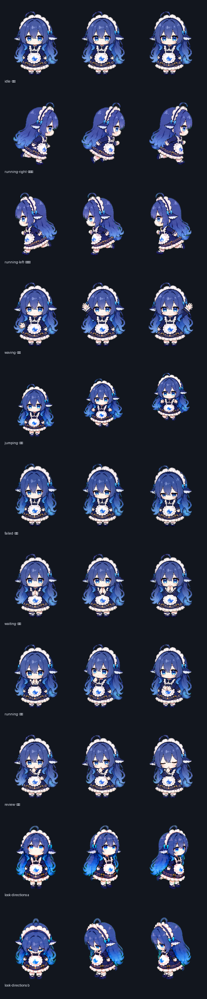

# dsh-blue-whale-maid

**蓝鲸女仆** —— DeepSeek Harness Web GUI（`dsh web`）的桌面宠物插件，本质是一个**任务完成提醒器**。

蓝发、鲸尾、蕾丝女仆装的 Q 版小伙伴：干活时她陪着你、播报进度，任务完成就跳起来提醒你，还能一键跳到对应会话。台词里藏着不少 DeepSeek 的梗。

> ⚠️ **美术素材版权**：精灵图等素材来自 [codex-pets.net](https://codex-pets.net/#/pets/blue-whale-maid)，原作者 **simashui**。代码 MIT，**素材不适用**，请勿商用。详见 [CREDITS.md](./CREDITS.md)。

## 展示


（图集 11 行动画，每行前 3 帧）

## 功能

- 💼 **任务完成提醒**：会话跑完 → 跳跃庆祝 + 气泡「「任务名」完成啦！」+「去看看 →」跳转按钮；跑挂 → 失败动画 + 提醒；多个完成排队播报
- 📣 **进度播报**：开工打招呼；工作中定期播报正在跑的命令 / 子代理描述
- ⏳ 会话等你确认（审批/提问）→ 等待动画 + 挥手 + 提醒气泡
- 🚶 待机呼吸、张望、原地小跑——不乱跑，只有拖动才移动
- 🖱️ 单击挥手、双击跳跃、拖动拎走；位置记忆、悬停隐藏、随时召唤回来
- 💬 中文台词（DeepSeek 梗）+ 出处致谢气泡；♿ 尊重 `prefers-reduced-motion`

## 安装

声明了 `dsh.bundle`，`dsh plugin add` 会自动注册，无需改任何配置：

```sh
curl -fsSL https://raw.githubusercontent.com/yuxino/dsh-blue-whale-maid/main/install.sh | sh
# 或：dsh plugin --profile web add github:yuxino/dsh-blue-whale-maid
```

重启 `dsh web`（或安装时加 `--restart`），刷新页面即可。卸载：`dsh plugin --profile web remove dsh-blue-whale-maid`。

## 开发

```sh
node tools/embed.mjs   # 把素材内联进 lib/client.js（生成产物，模板在 src/client.template.js）
```

已安装副本位于 `$DSH_HOME/profiles/web/node_modules/dsh-blue-whale-maid/`，改完 `lib/client.js` 会被 DSH 的 client-HMR 自动热更（约 1 秒，无需刷新）。

## 来源与许可

对 codex-pets.net「蓝鲸女仆」的 **DSH 移植**。

| 内容 | 来源 | 许可 |
|---|---|---|
| 插件代码 | 本仓库 [yuxino](https://github.com/yuxino) | MIT |
| 精灵图 / 海报 / 预览 / 元数据 | [codex-pets.net](https://codex-pets.net/#/pets/blue-whale-maid)，原作者 **simashui** | © simashui，勿商用 |
| 图集格式 | [Codex Pet v2 规范](http://codexpet.xyz/zh/spec/)（8 列 × 11 行，1536×2288） | 参考 |

详见 [CREDITS.md](./CREDITS.md)。
